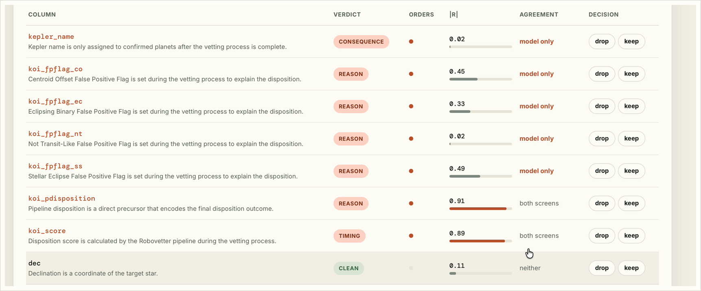
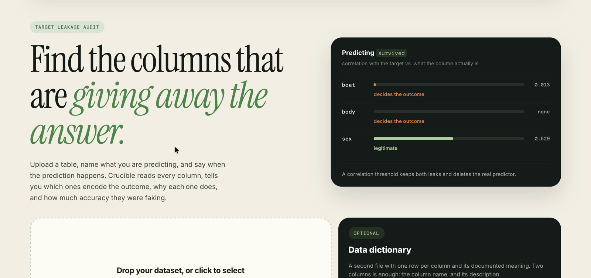
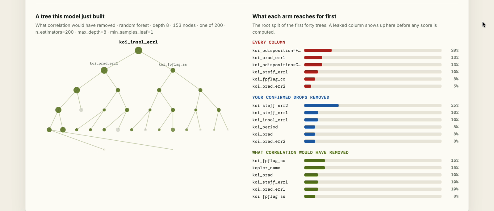
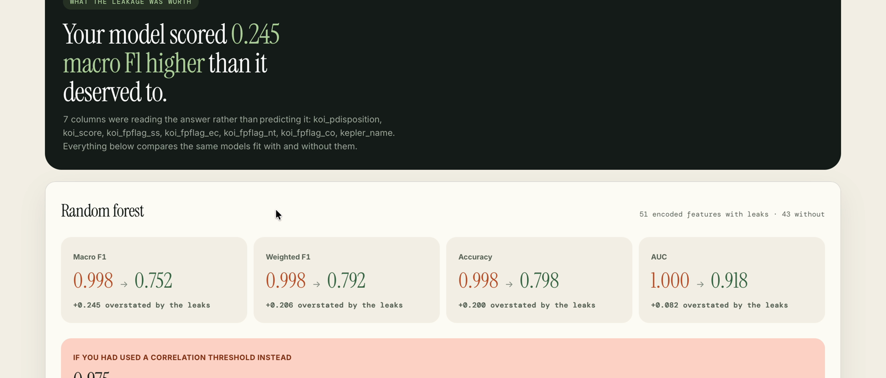
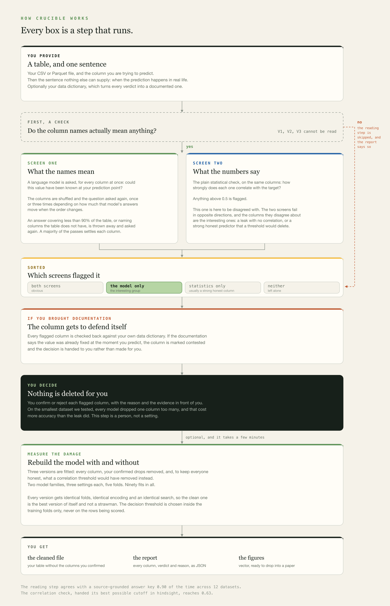
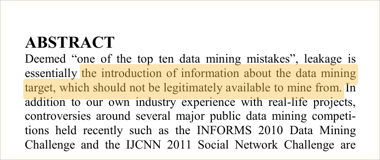

# Crucible

Find the columns in a table that encode the answer they are used to predict.

```bash
git clone https://github.com/smukilan9-ship-it/Crucible-Leakage
cd Crucible-Leakage
pip install -e ".[web]"
```

---

## What it found on NASA's Kepler catalogue



The four `koi_fpflag_*` columns are flags the vetting team set to record *why*
they decided an object was not a planet. Their correlations with the answer are
0.45, 0.33, 0.02 and 0.49. Every one sits under the 0.5 line a statistical filter
would draw, so nothing numerical finds them. A model trained with them got 11
rows wrong out of 5,000. Without them it got 1,009 wrong.

---

## Run it

```bash
crucible audit data.csv --target outcome --at "at admission, before any complication is recorded"
```

The `--at` sentence is the only thing the tool cannot work out for itself. It is
a fact about when your model runs, not about your data.

Add `--measure` to also refit with and without the flagged columns and report the
difference.

Or open the browser interface:

```bash
uvicorn web.app:app --port 8000
```







---

## How it works



---

## What it is measured against

604 columns across 15 datasets, where every label was traced back to the
dataset's own documentation.

| screen | agreement with the answer key |
|---|---|
| reading what the columns mean | 0.90 |
| correlation, best possible cutoff in hindsight | 0.63 |
| keyword matching on column names | 0.17 |

It flags and explains. It never deletes a column on its own: on the smallest
table tested, 131 rows, dropping one column too many cost more accuracy than the
leak had inflated.

---

## The idea is not new



Kaufman, Rosset, Perlich and Stitelman, *Leakage in Data Mining: Formulation,
Detection, and Avoidance*. KDD 2011, 556 to 563. Extended in ACM TKDD 6(4),
Article 15 (2012). doi:10.1145/2382577.2382579

Kapoor and Narayanan found leakage in 17 fields and 294 papers. *Leakage and the
Reproducibility Crisis in Machine-Learning-Based Science*, Patterns 4(9), 100804
(2023). doi:10.1016/j.patter.2023.100804

Existing tools read your code and catch pipeline faults. This one reads your
data. LeakageDetector, arXiv:2503.14723.

---

## Keys

Set one before running, and never in the repository:

```bash
export CRUCIBLE_GEMINI_KEYS=your-key
```

`crucible models` lists every model, what it costs you, and whether its key is
set.

---

Apache 2.0. Citation metadata in `CITATION.cff`.
