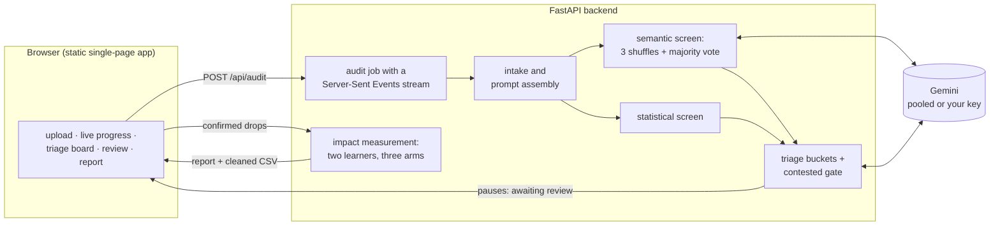

# Crucible

Upload a CSV, name the column you want to predict, and say when the
prediction would happen in real life. Crucible tells you which columns are
leaking the answer, why each one leaks, and how much accuracy the leaks were
faking. It never deletes anything on its own; you confirm every drop.

Built for Impact Forge 2026, Computational Research track. The semantic screen
runs on Google Gemini out of the box, on a shared pool, so the tool can be tried
without an account. Bring a key from OpenAI, Anthropic or
[Featherless.ai](https://featherless.ai) and it unlocks a stronger model: one
field takes any of the four, and which vendor issued it is read from the key's
own prefix rather than asked for.

## The problem

Every practitioner has met the model that scores 0.99 and turns out to be
worthless. The usual cause is a single column that encodes the outcome: a
"days in collections" field in a loan table, a complication code recorded
after the patient left the hospital, a fault flag that was used to assign the
label in the first place. The model learns to read the answer off that column,
the offline evaluation looks wonderful, and in deployment, where the column
does not exist yet, the model falls apart.

This failure is called target leakage. It is old and well known, and it still
happens constantly, because nothing in a standard workflow catches it. Cross
validation cannot catch it: the leaked column is present on both sides of
every split, so every fold agrees the model is excellent.

## Why no tool for this exists

We swept the two main public repositories of tabular machine learning
datasets, all 689 records on UCI and all 6,420 active on OpenML, and read every
statement about leakage we could find. Explicit, column-level documentation of
this failure exists for 7 datasets out of 7,109. That is 0.098%. On OpenML
the number is zero: every leakage-related sentence there is about duplicate
rows or identifier columns, which are different problems with different fixes.

That figure is a lower bound, and the research says so from its own evidence:
a frozen sieve is a lexical instrument, and it demonstrably missed a sentence
in a dataset that is inside the benchmark. The research then went looking
somewhere else entirely, across 8,693 Kaggle datasets, 605 competitions and
14,420 Hugging Face dataset cards. The sieve fires at a comparable rate in all
of them and yields two admissible records in total; the rest of the hits are
train/test split warnings, ethical disclaimers, "claim leakage" as an insurance
term, and the actual Enron email leak. What that licenses is not a claim about
how common leakage is, only that documented, machine-findable statements of it
are too rare to assemble a corpus from, in every documentation culture reachable
so far.

You cannot train or evaluate a detector on ground truth that was never
written down. That absence, not any technical barrier, is why no off-the-shelf
tool exists. The research behind Crucible built the missing corpus by hand:
604 columns across 15 datasets, 68 of them documented leaks, 62 licensed by a
verbatim quotation from the dataset's own documentation. That count is after an
audit of the ground truth against its own quotations, which withdrew eight of
the original labels and one entire proposed mechanism on the grounds that the
sources did not say what they had been read as saying. Every design decision in
this app was measured against that corpus before it earned its place here.

## Why the obvious statistical approach fails

The first idea everyone has is a correlation check: a column that correlates
too well with the target is suspicious. We benchmarked that idea with its
threshold tuned directly on the answer key, the most generous version of
itself, and it still could not do the job. It missed a leaked
`recoveries` column in a loan dataset, and it wanted to delete `sex` from the
Titanic dataset, which is legitimate and merely predictive.

The failure is structural. A correlation cannot distinguish "correlated
because it caused the label" from "correlated because it predicts the label."
That distinction is the entire problem. No threshold fixes it, because the
information needed to make the call is not in the numbers at all.

## Why reading the columns works

The information is in the column names and the documentation. A person
scanning a data dictionary spots `autopsy_code` in a mortality table
immediately, without computing anything, because the name says where the value
comes from: it exists only because the patient died. Language models can do
the same reading at scale. On the benchmark corpus every one of the ten models
tested beat the tuned correlation baseline, and nine of the ten beat it given
nothing but the column names and the target. Reading names and a target alone,
the best model reaches F1 **0.905**; the best figure anywhere on the condition
ladder is **0.918**, against **0.630** for correlation. Removing the columns a
model flagged brought the inflated score back to within **0.024** of the level a
fully documented cleaning reaches, where the correlation baseline lands 0.048
away and errs in both directions.

Three findings from that research shape how this app prompts the model.

First, models operationalize "leakage" as *timing*, and that is only part of
it. Measured across ten models from eight laboratories, baseline recall runs
97% on columns recorded after the prediction point, 89% on columns that exist
because the outcome happened, and **62% on columns that record why the label
was assigned**. The gap is concentrated entirely in the third kind. One clause
naming derivation as a second, separate reason moves that to 81% and leaves the
other two flat. Crucible ships that clause.

Second, and this is the part a tool has an incentive to leave out: **that clause
repairs weak detectors and does nothing measurable for the strongest ones.**
Resampling datasets rather than columns, every confidence interval that excludes
zero belongs to a model scoring under 0.66 without it. Claude Opus 5 moves
+0.004 with two columns going each way; Kimi K3 does not move at all. On the
default model the interval still spans zero, though the decisions themselves
move clearly: 19 columns corrected against 1 broken. Crucible ships the clause
because it costs nothing when it does not help and rescues a weak model when it
does, not because it improves every model.

Third, the clause is brittle, and there is no wording that is uniformly better.
Stated in temporal vocabulary it lets a literal reader excuse a column recorded
at the same moment as the target. One model un-flagged all six of a dataset's
sibling fault columns, reasoning "measured concurrently". Stated as a
reconstruction test it has no brake: on a synthetic dataset whose target is a
threshold rule over its own sensors, a frontier model flagged all ten columns.
Crucible therefore holds both wordings verbatim and picks per model from
measured results, rather than arguing for one in general.

## What the app does

1. **Intake.** You upload a table, name the target, and state the prediction
   point in plain words ("at admission, before any complication is
   observed"). If most column names are placeholders like `A17`, the semantic
   screen is skipped, because it reads names and there is nothing there to
   read, and the report says `INSUFFICIENT_SEMANTICS`. The statistical screen
   needs no names, so it still runs, and you get the half that works rather
   than a refusal.
2. **Semantic screen.** A language model judges every column
   against the target, three times in three different column orders, and the
   verdicts are combined by majority vote. The reordering exists because
   column order alone moves F1 by up to 0.380 between two shuffles of an
   identical prompt. This is a hedge and not a general remedy: order
   sensitivity is a property of the model, and one model in the study returned
   the same answer under three shuffles, so there was nothing to average. Three
   orders is the default because a user usually does not know which kind of
   model they have; `--shuffles 1` is correct for one measured stable, and it
   makes the audit three times cheaper.
3. **Statistical screen.** Four measures per column: absolute correlation,
   univariate area under the curve, missingness asymmetry, and a name pattern.
   This is a baseline, not a detector, and the app says so. With its threshold
   swept on the answers, which is an upper bound no real deployment can reach,
   correlation gets F1 0.630 against 0.918 for the semantic screen.

   One honest complication, surfaced rather than buried. On Titanic the
   *missingness gap* for `boat` is **0.943**: it is absent for almost everyone
   who died. Correlation is blind to that column and missingness is not, so a
   composite statistical screen would catch this particular leak. Measured
   across the whole corpus it is still the weaker instrument: with its own
   threshold swept on the answers, missingness reaches F1 0.245 (precision
   0.667, recall 0.150) against 0.630 for correlation. But on any single table
   it may see something correlation cannot, so the report shows all four
   numbers and lets a reader judge for themselves.
4. **Triage board.** Every column lands in one of four buckets: flagged by
   both screens (near certain), flagged only by the model (the leaks
   statistics cannot see), flagged only by statistics (usually just a strong
   predictor), or flagged by neither.
5. **Contested-column gate.** Every flagged column is checked against the
   documentation for one thing: does the source say the value was already
   fixed at the prediction point? If it was, the column is marked
   **CONTESTED** rather than asserted as a leak. This stage replaced an
   earlier one that was withdrawn. That stage claimed a fifth mechanism, a
   column that is a prior estimate of the same target, such as a physician's
   survival estimate, and no source could be found that
   licenses it. The concern is real: a model fed a physician's estimate
   predicts the physician. But that is a claim about what a model is *for*,
   not about whether a value could honestly have been obtained, and the tool
   should surface it rather than encode it as leakage.
6. **Human review.** You confirm or reject each flagged column. The app
   pauses here by design, and one dataset in the benchmark is the reason. On
   ECHO, the smallest table in the corpus at 131 rows, every model drops two
   columns where the documented answer drops one, and downstream F1 falls from
   a ceiling of 0.677 to **0.407**. At that sample size a single extra deletion
   is expensive. Over-flagging has a measurable cost, and it is the cost an
   autonomous deleter would pay silently.
7. **Impact measurement.** Three arms where the data allows: every column, your
   confirmed set, and what a correlation threshold would have removed instead.
   That third arm is the one that answers "would the cheap check have done this
   job?" On Titanic it answers no. The threshold drops `sex` and
   keeps both leaks, so its cleaned score is **0.974**, marginally *worse* than
   doing nothing at all, against 0.797 for the confirmed set.

   The decision threshold is chosen inside each fold on the training part only,
   never on the predictions being scored. Searching it over the pooled
   predictions overstates every arm, and unevenly: measured here it was +0.0015
   on the arm with leaks and +0.0190 on the cleaned one, which shrinks the very
   gap this tool exists to report.

   The app trains the same two learners twice, once
   with your confirmed drops and once without, on identical splits with an
   identical hyperparameter search, and reports the difference. Across the
   benchmark's twelve datasets, leaving the documented leaks in inflated F1 by
   0.147 on average and 0.306 at worst, and AUC by 0.129. The two are not
   redundant: on one dataset F1 moved 0.207 while AUC moved 0.015, so an
   AUC-only evaluation would have called it clean. You leave with a per-column
   report and a cleaned copy of your dataset.

## Why it matters

A leaked column does not announce itself. It makes every offline number
better, so it survives code review, passes every test, and gets rewarded until
the model meets reality. The cost lands later, in a deployed model that
performs far below its evaluation, and in published results that cannot be
reproduced. Reviewing a handful of columns before training is cheap
insurance against that outcome. In the benchmark corpus the strongest model
asked a reviewer to look at 48 of 306 columns, 16% of them, and that 16%
contained **every** documented leak in the set. This tool's default model asks
for 14% and catches 94%. Across all ten models tested the burden sat between
10% and 23%.

> **Provenance note.** The research benchmark that validates this tool's
> design predates the hackathon. All code in this repository was written
> during the hackathon window.

## Architecture



## What the downstream measurement reports

Not a single score. For each learner, every arm is reported side by side:
AUC, average precision, F1, precision, recall, specificity, balanced accuracy
and Matthews correlation, with the difference for each. Then the confusion
matrix for every arm at its own best-F1 threshold, so the error structure is
visible rather than summarized, followed by ROC, precision-recall, F1 across
the threshold range, and the per-fold AUC spread.

The confusion matrices are usually where the damage becomes obvious. On
Titanic with `boat` and `body` present, the model makes 35 errors; with those
two columns removed it makes 252. A drop in AUC alone understates that.

## Demo mode

Add `?demo` to the URL to walk the pipeline with no API key and no upload. Only
the detection stage is replayed, because that stage needs a model and a key.
Everything after it is live: the comparison fits the real learners on the real
Titanic table when you press the button, which is why editing the column set and
measuring again moves the numbers instead of redrawing the same ones.

Titanic is a good demonstration for a specific reason. `boat` correlates
-0.013 with survival and `body` has no computable correlation at all, yet both
decide the outcome; `sex` correlates -0.529 and is perfectly legitimate. Any
threshold on correlation gets all three of those backwards.

## Install

```bash
pip install crucible-leakage
```

That gives you the library and the `crucible` command. Python 3.11 or later.

```bash
pip install "crucible-leakage[web]"    # …plus the web interface
```

Working on Crucible itself, from a clone:

```bash
pip install -e ".[dev]"     # editable, with tests and the held-out evaluation
```

## Use it from the command line

```bash
crucible audit loans.csv --target default \
  --at "at approval, before any repayment or collections history exists"
```

`--at` is the prediction point and it is required, because leakage is a
property of the triple *(column, target, prediction point)* and that third
element is the one thing nothing can compute for you.

Useful additions:

| flag | what it does |
|---|---|
| `--dictionary FILE` | a CSV of `column,description`; grounds every verdict in your own documentation and makes each one quotable |
| `--measure` | also fit every arm and report what the flagged columns were worth |
| `--model ID` | pick a model; `crucible models` lists them |
| `--json` | the full report, for a pipeline |
| `--write-clean PATH` | write a copy without the flagged columns |

`--write-clean` will not run unattended without `--yes`. A tool whose argument
is that columns should not be dropped silently should not drop them silently.

Two more commands:

```bash
crucible impact loans.csv --target default --drop recoveries --drop collection_fee
crucible models
```

## Use it from Python

```python
import pandas as pd
from crucible import AuditRequest, run_audit, flagged_columns, quantify

table = pd.read_csv("loans.csv")
report = await run_audit(AuditRequest(
    table=table,
    target="default",
    prediction_point="at approval, before any repayment history exists",
))

leaks = flagged_columns(report)          # contested columns excluded by default
cost = quantify(table, "default", leaks) # what they were worth
```

`flagged_columns` leaves contested columns out unless you ask for them. A
contested column is flagged *and* documented as fixed at the prediction point,
so including it silently would be the library making exactly the call it exists
to hand back to you.

## Run the web interface

```bash
pip install -e ".[web]"
export CRUCIBLE_GEMINI_KEYS=...   # or leave unset and use the shared pool
uvicorn web.app:app --reload      # http://localhost:8000
```

The demonstration needs no key and no upload: it runs the real Titanic table
with a real downstream comparison computed server-side.

### Providing a shared pool for a demonstration

Set `CRUCIBLE_GEMINI_KEYS` to a comma-separated list of free-tier keys and the
interface offers a pooled option, so visitors can try the tool without an
account. Each key gets `CRUCIBLE_GEMINI_DAILY_LIMIT` requests a day (20 by
default), quota is spent least-used-first so one visitor cannot drain the pool
at once, and a request is counted when it is *started* rather than when it
succeeds, because a failed call still cost a free-tier request.

Keys are read from the environment only, never returned by any endpoint, and
never written to a log, not even a prefix, which is still a key to anyone who
has the rest. A test asserts this.

## Deploying

Render is the target, and `render.yaml` is checked in. Connect the repository,
then set two secrets in the dashboard: `FEATHERLESS_API_KEY`, and
`CRUCIBLE_GEMINI_KEYS` if you want the shared demonstration pool. Nothing else
needs configuring.

The service is deliberately an ordinary long-lived web process rather than a set
of serverless functions, and the app will not work as the latter. Three reasons,
each independent: an audit is a background task that outlives the request that
started it; the job it produces is held in memory and read by four later
requests; and a full audit runs for minutes, well past any serverless duration
cap. A fourth, smaller one is that the dependency set is around 310 MB, over the
250 MB limit such platforms impose.

Two things worth knowing before a live demonstration:

**Cold starts.** Render's free instances sleep after fifteen minutes idle and
take roughly fifty seconds to wake. `render.yaml` therefore specifies `starter`,
which does not sleep. On a free instance, open the page a minute before you
need it.

**The event stream needs its heartbeat.** A stage can take minutes, and hosted
proxies close connections that have gone quiet. The stream sends a comment line
every fifteen seconds for exactly this reason, and the response carries
`X-Accel-Buffering: no` so an nginx in front does not buffer it into
uselessness. Both only matter once deployed, which is the kind of thing that is
discovered during a demonstration if it is not checked first.

## Layout

```
src/crucible/        the library: intake, prompts, screens, fusion,
                     contested gate, metrics, impact, CLI
src/crucible/providers/   anthropic, featherless, gemini (pooled), openai,
                          key pool, one OpenAI-shaped base class
web/                 FastAPI service + static interface
tests/               59 tests, no network
evaluation/          held-out set, answer key, scoring harness
```

The service holds no pipeline logic. Whatever the command line does, the web
interface does, because both call `crucible.audit.run_audit`.

## API

| endpoint | what it does |
|---|---|
| `POST /api/audit` | upload CSV + target + prediction point, returns a job id |
| `GET /api/audit/{id}/events` | live progress as Server-Sent Events |
| `GET /api/audit/{id}` | full job state |
| `POST /api/audit/{id}/review` | record human decisions, `{column: "drop" or "keep"}` |
| `POST /api/audit/{id}/impact` | train both fits, report the AUC difference |
| `GET /api/audit/{id}/report` | the full audit as JSON |
| `GET /api/audit/{id}/cleaned.csv` | your dataset with confirmed drops removed |

## References

The formulation this tool implements, and the work it sits beside.

- **Kaufman, S., Rosset, S., Perlich, C. & Stitelman, O.** (2012). Leakage in
  Data Mining: Formulation, Detection, and Avoidance. *ACM TKDD* 6(4), Article
  15. `10.1145/2382577.2382579`. (Earlier: KDD 2011, 556–563.) Legitimacy
  relative to a target and a time; the learn/predict separation.
- **Kapoor, S. & Narayanan, A.** (2023). Leakage and the reproducibility crisis
  in machine-learning-based science. *Patterns* 4(9), 100804. Seventeen fields,
  294 affected papers, a taxonomy of eight leakage types.
- **Rosset, S., Perlich, C., Świrszcz, G., Melville, P. & Liu, Y.** (2010).
  Medical data mining: insights from winning two competitions. *Data Mining and
  Knowledge Discovery* 20(3), 439–468. `10.1007/s10618-009-0158-x`.
- **Larsen, K. R. & Becker, D. S.** (2019). Seven Types of Target Leakage in
  Machine Learning and an Exercise. In *Automated Machine Learning for
  Business*, Oxford University Press, ch. 24.

What current tooling actually detects, and why it cannot see this failure:

- **LeakageDetector** (arXiv:2503.14723) and **LeakageDetector 2.0**
  (arXiv:2509.15971, ICSME 2025). Static analysis of notebooks for overlap,
  preprocessing and multi-test leakage. A feature-level leak is not in the code,
  so static analysis cannot reach it.
- **Breck, E., Polyzotis, N., Roy, S., Whang, S. E. & Zinkevich, M.** (2019).
  Data Validation for Machine Learning. *MLSys*.
- **Schelter, S. et al.** (2018). Automating large-scale data quality
  verification. *PVLDB* 11(12), 1781–1794.

Language models over tabular schemas, and the memorisation caveat that any
semantic screen on a public dataset has to answer:

- **Narayan, A., Chami, I., Orr, L. & Ré, C.** (2022). Can Foundation Models
  Wrangle Your Data? *PVLDB* 16(4), 738–746.
- **Hegselmann, S. et al.** (2023). TabLLM. *AISTATS*, PMLR 206, 5549–5581.
- **Bordt, S., Nori, H., Rodrigues, V., Nushi, B. & Caruana, R.** (2024).
  Elephants Never Forget: Memorization and Learning of Tabular Data in Large
  Language Models. *COLM*. arXiv:2404.06209. Many popular tabular datasets are
  memorised verbatim; read before trusting a semantic screen on a public table.

Documentation standards this work measures against:

- **Gebru, T. et al.** (2021). Datasheets for Datasets. *CACM* 64(12), 86–92.
- **Pushkarna, M., Zaldivar, A. & Kjartansson, O.** (2022). Data Cards.
  *FAccT '22*.
