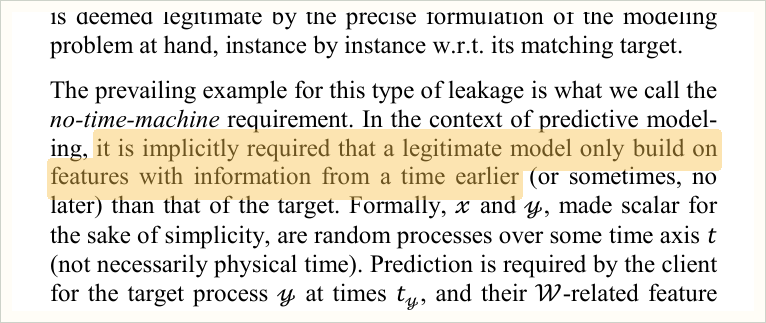
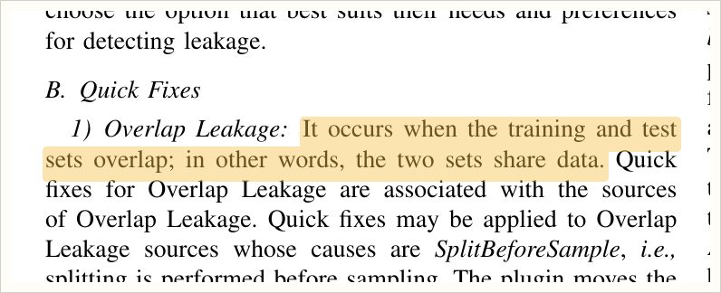

# Crucible

A tool that finds the columns in a dataset that are quietly giving away the
answer, before a model gets built on them and published.

---

## The problem

Here is a model I built on NASA's Kepler catalogue, predicting whether an
observed object is a real planet. Ordinary code. Correct split, five folds,
every row scored by a model that never saw it. Out of five thousand objects it
got eleven wrong.

That model is worthless, and nothing in the code says so.

Four of the columns are called `koi_fpflag_nt`, `koi_fpflag_ss`, `koi_fpflag_co`
and `koi_fpflag_ec`. They are flags the vetting team sets while deciding whether
an object is a planet, and they exist to record why the team decided it. Not
transit like. Stellar eclipse. Centroid offset. Eclipsing binary.

A flag that says "this looks like an eclipsing binary and not a planet" is not a
measurement of the star. It is a note explaining the answer, written at the same
moment as the answer. My model was not predicting anything. It was reading those
four notes and handing the answer back.

This is not a niche accident. Two researchers went looking for it across
published work and reported what they found.

> "we find 17 fields where leakage has been found, collectively affecting 294
> papers and, in some cases, leading to wildly overoptimistic conclusions"
>
> Sayash Kapoor and Arvind Narayanan, *Leakage and the Reproducibility Crisis in
> Machine-Learning-Based Science*, Patterns 4(9), 100804 (2023).
> doi:10.1016/j.patter.2023.100804

The problem has a name and a definition, and it has had both since 2011.


> Shachar Kaufman, Saharon Rosset, Claudia Perlich and Ori Stitelman, *Leakage
> in Data Mining: Formulation, Detection, and Avoidance*. KDD 2011, 556 to 563.
> Extended in ACM Transactions on Knowledge Discovery from Data 6(4), Article 15
> (2012). doi:10.1145/2382577.2382579

The same paper gives the test, and the test is short enough to remember. A
column is fair only if its value could have been known before the thing being
predicted happened.



Written out, for a feature $X$ and a target $y$ predicted at time
$t_{\text{pred}}$, the column is admissible only when

$$t_X \le t_{\text{pred}} < t_y$$

where $t_X$ is the moment $X$'s value is fixed and $t_y$ the moment the outcome
is settled. The authors call it the no time machine requirement. Applying it
takes someone who knows what each column actually is, and by the time a dataset
reaches you, that person is usually gone.

## Why the obvious check does not work

The obvious check is to look for columns that correlate suspiciously well with
the target and delete those. Pick a cutoff $\tau$ and drop every column where

$$|r(X, y)| > \tau, \qquad \tau = 0.5$$

Try that on the Titanic passenger list. There is a column called `boat`, the
lifeboat number a passenger was rescued in. It only has a value if they
survived, so it gives the answer away completely, and its correlation with
survival is $-0.013$. There is `body`, the body recovery number, which has no
computable correlation at all. And there is `sex`, which correlates at $-0.529$
and is entirely legitimate, because you know it the moment someone boards.

A correlation filter ranks all three of those backwards. Set $\tau$ low enough to
catch the two cheats and it deletes the honest column first.

That is not a thought experiment. Crucible runs that filter as a control arm on
every measurement, and on Titanic the filtered model scores *higher* than doing
nothing at all, because it dropped `sex` and kept both cheats. It would have
reported success.

Back on the Kepler table, the same thing happens with less drama and more
consequence. Here is what the tool returned, with each column's correlation
sitting next to the verdict.


Look at the second-to-last column. Seven columns were flagged. Two of them were
caught by both screens, and five by the reading alone.

The two the statistics caught are `koi_pdisposition` at $0.91$ and `koi_score` at
$0.89$. Those are the easy ones. They are numeric summaries of the vetting
outcome, and they track the answer closely enough that any threshold finds them.

The four flags sit at $0.45$, $0.33$, $0.02$ and $0.49$. Every one of them falls
below the $0.5$ line, and `koi_fpflag_ss` misses it by a hundredth. There is no
cutoff that catches those four and leaves the real measurements alone: `dec` and
`kepid` in the same table sit at $0.11$, and plenty of legitimate astronomy sits
higher than $0.49$.

So the four columns that gave the answer away most directly are exactly the four
that nothing numerical would have found. They are integers. They were split
correctly and scaled correctly. The only thing wrong with them is what they
mean, and the only way to reach that is to read the name and the documentation.

## What already exists, and what it does not cover

There are good tools for leakage already. The closest is LeakageDetector, a
PyCharm plugin that reads machine learning code and finds three specific faults.



> Drake, Pham, Rahman and colleagues, *LeakageDetector: An Open Source Data
> Leakage Analysis Tool in Machine Learning Pipelines*. arXiv:2503.14723

Training on the test data. Cleaning the data before splitting it. Reusing a test
set. All three are real, all three are common, and all three are mistakes in the
code, which is why a code analyser can find them.

None of them is the Kepler problem. My split was correct. My folds were correct.
Nothing touched the test set. The fault was in four columns, and no amount of
reading the source will tell you what a column means.

Crucible works one layer down, on the data rather than on the pipeline. If you
are being careful you want both, and they do not overlap.

## How it works


You give it a table, the column being predicted, and one sentence saying when the
prediction would happen in real life. That sentence is the only thing the tool
cannot work out for itself, because it is a fact about how the model gets used
and not about the data.

Two screens then run over every column. One is a language model reading the
column names against the prediction point, asked the same question in several
different column orders and made to answer for the whole table before its answer
counts. The other is the plain correlation check. Both are reported, and they are
meant to disagree: the columns one flags and the other misses are the ones worth
attention.

If a data dictionary was supplied, every flagged column is then checked back
against that documentation. When the documentation says the value was already
settled at the moment of prediction, the column is marked as contested and the
decision goes to the person running it.

Then it stops and waits. Crucible does not delete anything.

To find out what the flagged columns were actually worth, it will rebuild the
model twice, once with them and once without, and report the difference

$$\Delta = \text{score}_{\text{with}} - \text{score}_{\text{without}}$$

under identical folds, identical encoding and an identical hyperparameter search
on both sides, so the clean version is the best version of itself rather than a
strawman. On the Kepler table that difference was eleven mistakes against one
thousand and nine.

## Who this is for

Anyone who trains a model on a table they did not collect themselves.

That is most of computational science. You download a public dataset, or inherit
one from a collaborator, or pull an export from a clinical system. It arrives
with forty or ninety columns, some documented, most named by somebody who has
left. There is a deadline. The model gets fitted and it works well.

Researchers about to submit. The screen takes about a minute on a table of fifty
columns, which is a cheap thing to do before writing the results section and an
expensive thing to skip. The report it produces is also a record of what was
checked and why the kept columns were kept, which is the part a reviewer asks
about.

Reviewers. Run it on the authors' data and get a list, column by column, of what
looks unsafe and why, without needing to know the field.

Anyone doing a reproducibility study. That is exactly the work the Patterns paper
describes, and it was done by reading datasets by hand.

## How to use it

Three ways, and they all do the same thing.

In a browser, to watch what it is doing. Drop the file in, name the target, type
the sentence, and both screens run in front of you.

From the command line, which is where it belongs in a pipeline:

```
crucible audit data.csv --target outcome --at "at admission, before any complication is recorded"
```

Or as a Python import, to get the verdicts inside your own script.

The output is the cleaned file, a report with every column and every verdict and
the reason for it, and the figures as vector files that go straight into a paper.

## Why it asks rather than deletes

Because deleting can cost more than the leak does.

The smallest dataset in the benchmark has 131 rows. On that one, every model I
tested flagged one column too many, and the accuracy lost to that extra deletion
was larger than the accuracy the leak had inflated. An automatic cleaner would
have made things worse and reported that it had helped.

So Crucible flags, explains, and stops. The last word stays with the person, and
on a small table that is not a courtesy. It is the difference between a better
model and a worse one.

## What I measured

The tool comes out of a benchmark built for this question: 604 columns across 15
datasets, where every label was traced back to the dataset's own documentation
rather than to anybody's opinion.

Reading the column names agrees with that answer key nine times out of ten. The
correlation check, handed the most favourable cutoff in hindsight, gets it right
about two thirds of the time. Matching column names against a keyword list
catches almost nothing.

On a typical table you are asked to look at fourteen percent of the columns, and
doing so catches about ninety four percent of what is there.

Those are the numbers the tool quotes about itself, and every one of them names
the section of the paper it comes from.
